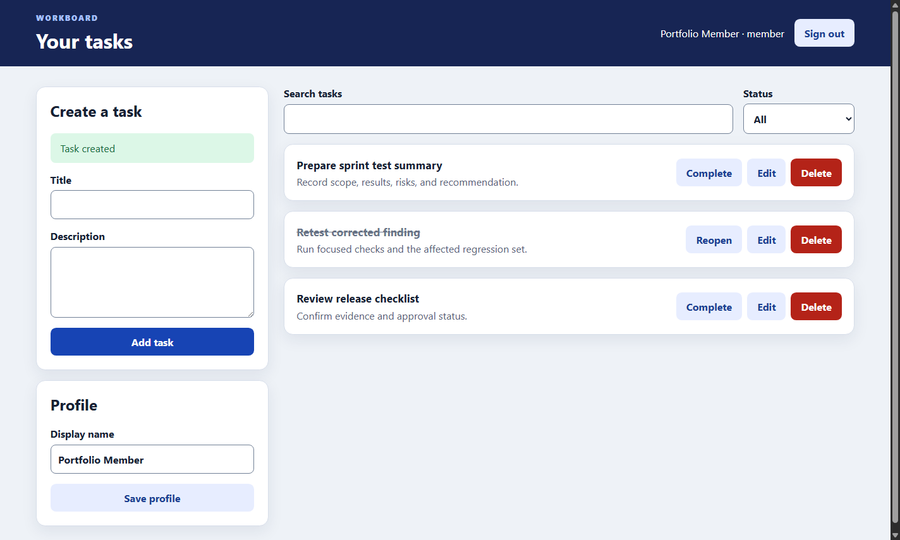
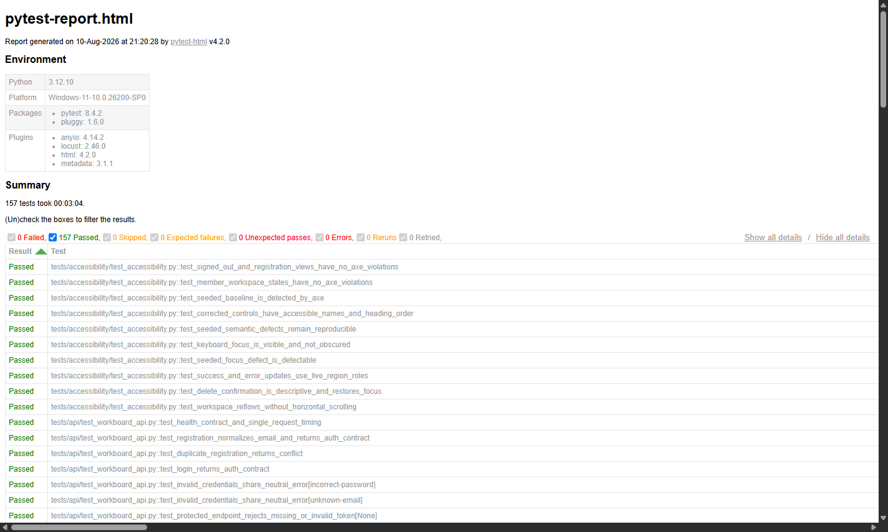

# WorkBoard QA Portfolio

[](https://github.com/gjockers70/workboard-qa-portfolio/actions/workflows/quality-gates.yml)

WorkBoard is a small full-stack task application surrounded by a production-style quality-engineering project. The application stays intentionally compact so the repository can emphasize test design, automation architecture, traceability, defect handling, accessibility, delivery gates, and honest release reporting.

## Project purpose

This repository demonstrates a complete testing workflow across a React interface, FastAPI service, and SQLite database. It combines manual and automated evidence instead of treating test count as the goal.

The approved Phase 14 product baseline recorded:

- 140 passing repository tests with zero failures, errors, or skips;
- 125 of 125 final checks passed across 11 completed managed cycles;
- 56 of 56 acceptance criteria linked to approved test cases;
- four confirmed defects closed after retest and regression;
- a passing hosted quality-gate workflow; and
- a scoped release recommendation in the [final test summary](TEST_SUMMARY_REPORT.md).

Phase 15 documentation and repository cleanup is approved and published after the 157-test local validation.

## Screenshots

### WorkBoard member workspace

The application image uses a disposable synthetic account and synthetic task data.



## Example test report

Pytest produces a self-contained HTML report and JUnit XML for every normal run. The image below is a reviewed preview; generated reports remain under the ignored `reports/` directory, while hosted reports are retained as workflow artifacts.



The durable decision record is the [technical and stakeholder test summary](TEST_SUMMARY_REPORT.md). Runtime evidence is regenerated with the commands in the [runbook](RUNBOOK.md).

The tracked images can be reproduced with `scripts/capture_documentation_images.py`. The workspace capture starts disposable local services and synthetic data; after the runbook's all-pass precondition, the report capture verifies and reads the current local HTML report.

## Architecture

```text
Selenium browser checks ---> React + TypeScript ---> FastAPI REST API ---> SQLite
                                      ^                    ^                 ^
                                      |                    |                 |
                              accessibility checks    API contract tests   SQL checks
                                      \________________ integration comparisons

GitHub Actions ---> build ---> artifact checks ---> service tests ---> browser gates ---> evidence
```

The layers stay deliberately separate:

- browser tests assert visible interface behavior through Page Objects;
- API tests use a reusable HTTP client and independent response contracts;
- database tests use isolated SQLite files and independent SQL inspection;
- integration checks compare service results with persisted state;
- management checks reconcile requirements, cases, cycles, executions, defects, and reports; and
- GitHub Actions reproduces the fast release-quality gates without deploying the application.

See [ARCHITECTURE.md](ARCHITECTURE.md) for component boundaries, tradeoffs, browser configuration, synchronization, data isolation, and evidence flow. See [TEST_STRATEGY.md](TEST_STRATEGY.md) for the risk model and test-selection rules.

## Technology stack

| Area | Technology | Repository use |
|---|---|---|
| Frontend | React, TypeScript, Vite | Authenticated task interface, responsive behavior, and seeded accessibility baselines |
| Backend | Python, FastAPI, Pydantic | Authentication, profile, task CRUD, validation, authorization, and REST contracts |
| Persistence | SQLite, SQLAlchemy, parameterized SQL | Local storage, constraints, isolated fixtures, and API-to-database comparison |
| Browser automation | Selenium WebDriver, pytest | Page Objects, fixtures, explicit waits, stable selectors, screenshots, markers, and regression |
| Service testing | httpx, Pydantic contracts | Direct REST testing for positive, negative, auth, schema, and error paths |
| Accessibility | axe-core, Lighthouse, WAVE, NVDA, keyboard testing | Automated rules plus manual and tool-assisted assessment |
| Performance | Locust | Small loopback-only authenticated read baseline |
| Reporting | pytest-html, JUnit XML, Markdown, CSV, XLSX | Runtime reports, test-management registers, and stakeholder summaries |
| Delivery | GitHub Actions | Build, six blocking test groups, executable quality gates, and retained evidence |

Direct Python requirements are version pinned. Frontend installations use exact direct versions and the committed lockfile through `npm ci`.

## Testing types and evidence

| Testing type | What is covered | Primary evidence |
|---|---|---|
| Manual functional and usability | 37 final passing workflows, including validation, navigation, recovery, responsive behavior, and feedback clarity | [Manual execution register](test-management/TEST_EXECUTIONS.csv) |
| Smoke | Critical sign-in, task creation/lifecycle, and sign-out readiness | [UI tests](tests/ui) and hosted gate reports |
| Functional and regression | Registration, login/logout, profile, CRUD, negative input, search/filter, and role behavior | [Functional regression suite](tests/ui/test_functional_regression.py) |
| API and web services | REST methods, auth, authorization, invalid data, schemas, 4xx behavior, controlled 5xx behavior, and timing observations | [API suite](tests/api/test_workboard_api.py) and [web-services notes](docs/WEB_SERVICES_TESTING.md) |
| Database and integration | Schema, constraints, persistence, transformations, ownership, counts, and API-to-SQL comparisons | [Database suite](tests/database/test_workboard_database.py) |
| Remote-access concepts | Executed local refresh/interruption/reconnect recovery plus clearly separated design-only remote scenarios | [Remote-access testing notes](docs/REMOTE_ACCESS_TESTING.md) |
| Accessibility | axe-core, Lighthouse, WAVE, keyboard, focus, semantics, contrast, feedback, NVDA, remediation, and retest | [Accessibility test plan](accessibility/ACCESSIBILITY_TEST_PLAN.md) |
| Performance | 10-user, 30-second safe loopback baseline measuring response time, throughput, concurrency, and errors | [Performance results](performance/PERFORMANCE_RESULTS.md) |
| User acceptance | Six disclosed simulated business scenarios with observations, classifications, exceptions, and sign-off template | [UAT summary](uat/UAT_SUMMARY.md) |
| Remediation and retesting | Four closed-defect confirmations plus impact-based regression | [Phase 12 retest summary](remediation/PHASE_12_RETEST_SUMMARY.md) |
| CI/CD and reporting | Build, artifact integrity, API, database, browser, accessibility, gate evaluation, and report reconciliation | [CI/CD design](docs/CI_CD.md) and [final summary](TEST_SUMMARY_REPORT.md) |

Automation is used for deterministic, repeatable, high-value checks. Keyboard and screen-reader behavior, WAVE interpretation, exploratory usability, business-user observation, and environment-specific judgment remain manual or tool assisted because human interpretation determines their result.

## Automation framework structure

```text
app/
|-- frontend/                  React and TypeScript user interface
`-- backend/app/              FastAPI service, models, schemas, and management command
framework/
|-- accessibility/            reusable axe-core integration
|-- clients/                  REST client and independent response contracts
|-- config/                   environment-backed test settings
|-- data/                     unique synthetic-data factories
|-- database/                 independent SQL inspection helpers
|-- drivers/                  Brave, Chrome, and Edge driver creation
|-- management/               CSV register parsing and artifact checks
|-- pages/                    Page Objects and condition-based waits
`-- utilities/                failure evidence helpers
tests/
|-- accessibility/            automated accessibility regression
|-- api/                      service contracts and authorization
|-- ci/                       workflow and quality-gate contracts
|-- database/                 isolated persistence and integration checks
|-- documentation/            repository-document integrity checks
|-- performance/              safe runner and record validation
|-- remediation/              defect/retest artifact reconciliation
|-- reporting/                release-summary consistency checks
|-- test_management/          cases, cycles, executions, and traceability
|-- uat/                      UAT artifact and browser replay checks
`-- ui/                       Selenium smoke, functional, and regression tests
accessibility/                plans, manual cases, findings, and retest evidence
agile/                        backlog, stories, sprint, triage, and review records
test-management/              CSV and formatted test-management registers
uat/                          simulated UAT plan, session, issues, and outcome
performance/                  workload definition and bounded results
remediation/                  correction-chain and regression evidence
docs/                         operating models and specialized guidance
.github/workflows/            fast quality gates and manual performance run
```

Page Objects centralize locators, waits, and reusable interactions so interface changes have a controlled maintenance point. Assertions remain in tests to keep expected behavior visible. The tradeoff is additional abstraction: Page Objects must remain small and behavior focused or they can hide intent.

## Local setup

The commands below use one virtual environment at the repository root. Detailed troubleshooting and cleanup steps are in [RUNBOOK.md](RUNBOOK.md).

### 1. Install dependencies

From the repository root in PowerShell:

```powershell
python -m venv .venv
.venv\Scripts\python.exe -m pip install --upgrade pip
.venv\Scripts\python.exe -m pip install -r app\backend\requirements.txt -r requirements-test.txt
npm.cmd ci --prefix app\frontend
```

### 2. Prepare a synthetic administrator

Use the same synthetic identity for account creation and authenticated test commands:

```powershell
$env:WORKBOARD_TEST_USER_EMAIL = "synthetic.admin@example.test"
$env:WORKBOARD_TEST_USER_PASSWORD = "choose-a-unique-local-password"
$env:WORKBOARD_ADMIN_PASSWORD = $env:WORKBOARD_TEST_USER_PASSWORD

Push-Location app\backend
..\..\.venv\Scripts\python.exe -m app.manage create-admin `
  --email $env:WORKBOARD_TEST_USER_EMAIL `
  --display-name "Synthetic Test Administrator"
Pop-Location

Remove-Item Env:WORKBOARD_ADMIN_PASSWORD
```

The password must contain at least 12 characters. Do not store it in the repository.

### 3. Start the application

Backend, from the repository root in Terminal 1:

```powershell
Push-Location app\backend
..\..\.venv\Scripts\python.exe -m uvicorn app.main:app --host 127.0.0.1 --port 8000
```

Frontend, from the repository root in Terminal 2:

```powershell
npm.cmd --prefix app\frontend run dev -- --port 5173 --strictPort
```

Open `http://127.0.0.1:5173`. The API health endpoint is `http://127.0.0.1:8000/health`, and interactive API documentation is at `http://127.0.0.1:8000/docs`.

### 4. Run tests

Keep the two services running and execute commands from the repository root in the terminal that contains the test credentials.

```powershell
# Complete repository regression in verified headless Brave
.venv\Scripts\python.exe -m pytest --browser brave

# Focused selections
.venv\Scripts\python.exe -m pytest -m smoke --browser brave
.venv\Scripts\python.exe -m pytest -m regression --browser brave
.venv\Scripts\python.exe -m pytest tests\api
.venv\Scripts\python.exe -m pytest tests\database -W error::DeprecationWarning
.venv\Scripts\python.exe -m pytest tests\accessibility --browser brave -W error::DeprecationWarning

# Frontend production build
npm.cmd --prefix app\frontend run build
```

Member scenarios generate unique accounts through the interface. The privileged scenarios use only the synthetic administrator passed through environment variables. Database tests use isolated temporary files and do not modify the local development database.

When finished, stop both services and remove the test variables:

```powershell
Remove-Item Env:WORKBOARD_TEST_USER_EMAIL -ErrorAction SilentlyContinue
Remove-Item Env:WORKBOARD_TEST_USER_PASSWORD -ErrorAction SilentlyContinue
```

## Controlled defect modes

The normal application starts with corrected behavior. Two disabled-by-default switches reproduce approved historical baselines for test exercises:

- `WORKBOARD_SEEDED_FUNCTIONAL_DEFECTS=true` activates the backend functional baseline.
- `VITE_SEEDED_ACCESSIBILITY_DEFECTS=true` activates the frontend accessibility baseline.

During local frontend development, the accessibility baseline can also be opened with `?accessibility-defects=true`. Production builds ignore that query switch. Every normal regression and release-quality run keeps these controls disabled.

## Accessibility

Accessibility is treated as a distinct test discipline, not a single scanner result. The project combines automated axe-core checks with Lighthouse, WAVE, keyboard-only execution, contrast review, semantic inspection, focus testing, error-message checks, and NVDA announcement evidence.

The corrected scope recorded 10 passing dedicated automated checks, a Lighthouse accessibility score of 100, WAVE retests with zero errors, contrast errors, or alerts, and successful keyboard and NVDA retests. These results apply only to the documented workflows and environments. They are not a legal-compliance or certification claim, and automation cannot replace manual keyboard and screen-reader assessment.

Evidence: [plan](accessibility/ACCESSIBILITY_TEST_PLAN.md), [manual cases](accessibility/MANUAL_TEST_CASES.md), [findings](accessibility/FINDINGS.md), [NVDA results](accessibility/NVDA_RESULTS.md), and [remediation/retest](accessibility/REMEDIATION_RETEST.md).

## User acceptance testing

Phase 11 used a disclosed single-person simulation of an operations coordinator. Six business-goal scenarios passed. One observation was classified as a requirement misunderstanding about the intentionally read-only administrator view, and one due-date/priority request was classified as a deferred enhancement. Neither was misrepresented as a product defect.

The workflow covers scenario design, synthetic data, observation without coaching through a failure, questions, triage, defect-versus-misunderstanding-versus-enhancement classification, retest, summary, and sign-off status. It is portfolio evidence of the implemented process, not a claim of real-client participation.

Evidence: [UAT plan](uat/UAT_PLAN.md), [scenarios](uat/UAT_SCENARIOS.md), [session notes](uat/UAT_SESSION_NOTES.md), [issue log](uat/UAT_DEFECT_LOG.md), [retest results](uat/UAT_RETEST_RESULTS.md), and [summary](uat/UAT_SUMMARY.md).

## Agile Test Management

The local operating model mirrors Jira for stories and defects, Confluence for readable plans and summaries, and Zephyr Scale for cases, cycles, executions, and links. No paid or hosted product administration is claimed.

The sprint workflow is:

`Backlog -> Selected for Sprint -> In Progress -> Ready for Test -> In Test -> Ready for Retest -> Done`

One implemented trace chain is:

```text
US-007 Enforce task ownership
-> AC-US007-02 Member cannot update another member's task
-> TC-API-AUTHZ-001
-> tests/api/test_workboard_api.py::test_member_cannot_mutate_another_members_task
-> CYCLE-PH6-API-20260810
-> Pass
-> no defect required
-> Covered
```

- Jira-style story: `US-007`, priority Must, five-point estimate, status Done.
- Zephyr-style case: `TC-API-AUTHZ-001`, linked to `FR-AUTHZ-001` and `AC-US007-02`.
- Defect example: `DEF-P3-001` links an original failed accessibility execution to correction, passing retest, regression, and Closed status.
- Regression execution: `CYCLE-PH5-REGRESSION-20260810` passed six critical UI cases and allowed broader testing to continue.
- Sprint test summary: [agile/SPRINT_TEST_SUMMARY.md](agile/SPRINT_TEST_SUMMARY.md).

The [Agile operating guide and tool mapping](docs/AGILE_TEST_MANAGEMENT.md) explains the practical story-to-release workflow. Machine-readable sources are [cases](test-management/TEST_CASES.csv), [cycles](test-management/TEST_CYCLES.csv), [executions](test-management/TEST_EXECUTIONS.csv), and [traceability](test-management/REQUIREMENTS_TRACEABILITY.csv).

## Web-services testing

REST is the implemented service boundary. Tests construct JSON requests, apply bearer authentication, validate status and content against independent schemas, verify authorization and invalid-data behavior, and normalize error inspection through a reusable client.

SOAP is covered as a conceptual comparison rather than an invented service. A SOAP-style check would construct an XML envelope, supply its action and authentication mechanism, validate namespaces and XML schema content, and distinguish a SOAP Fault from an HTTP transport error. See [Web-services testing](docs/WEB_SERVICES_TESTING.md) for the side-by-side example and claim boundary.

## CI/CD

The `Quality Gates` workflow runs for pull requests, pushes to `main`, and manual dispatch. It:

1. installs version-pinned direct Python requirements and the locked frontend dependencies;
2. builds the TypeScript/Vite frontend;
3. runs unit and artifact checks;
4. starts FastAPI and Vite against an ephemeral runner database;
5. runs API, database, smoke, critical-regression, and accessibility groups;
6. evaluates blocking policy from JUnit results and management records; and
7. retains reports, screenshots, service logs, and driver diagnostics for 14 days.

The blocking rules require every selected check to execute and pass, 100% critical-regression pass rate, no open Critical defect, and complete acceptance-criteria coverage. The repository intentionally has no deployment job, so a passing workflow is release-quality evidence rather than a production deployment claim.

The bounded Locust baseline uses a separate manual-only workflow and never targets an external system. See the [CI/CD and quality-gate design](docs/CI_CD.md).

## Evidence index

| Artifact | Purpose |
|---|---|
| [Requirements](docs/REQUIREMENTS.md) | Functional and non-functional baseline |
| [Test strategy](TEST_STRATEGY.md) | Risk model, layer selection, automation boundaries, and gates |
| [Test plan](TEST_PLAN.md) | Scope, roles, environments, schedule, LOE, entry, and exit criteria |
| [Traceability matrix](TRACEABILITY_MATRIX.md) | Readable requirement-to-final-status chains |
| [Defect log](DEFECT_LOG.md) | Severity, priority, evidence, lifecycle, correction, and retest |
| [Accessibility plan](accessibility/ACCESSIBILITY_TEST_PLAN.md) | Tools, manual coverage, evidence, and non-certification boundary |
| [UAT plan](uat/UAT_PLAN.md) | Facilitation, issue classification, retest, and acceptance workflow |
| [Sprint plan](agile/SPRINT_PLAN.md) | Incremental delivery and test schedule |
| [Test summary report](TEST_SUMMARY_REPORT.md) | Technical decision and short stakeholder summary |
| [Runbook](RUNBOOK.md) | Reproducible setup, execution, evidence, troubleshooting, and cleanup |

## Skills demonstrated

The implemented repository provides direct, inspectable practice with:

- building a Selenium and pytest framework from scratch with fixtures, Page Objects, stable selectors, explicit waits, synthetic data, cleanup, and failure evidence;
- manual functional, smoke, regression, integration, negative, usability, recovery, and role-based testing;
- reusable REST clients, independent response contracts, authentication, authorization, and error testing;
- SQL schema, constraint, persistence, transformation, ownership, row-count, and API-to-database validation;
- accessibility assessment with axe-core, Lighthouse, WAVE, NVDA, keyboard testing, documented remediation, and retest;
- safe local Locust execution and interpretation of response time, throughput, concurrency, and error rate;
- Agile backlog, acceptance criteria, test cases, cycles, executions, defects, traceability, remediation, UAT, LOE, and release reporting; and
- GitHub Actions, headless browser execution, generated artifacts, and executable quality gates.

These are repository-backed exercises. They do not imply production operations, paid tool administration, formal certification, or client employment.

## Known limitations

- WorkBoard is a local demonstration application; no production deployment or monitoring is included.
- SQLite is the validated database. PostgreSQL portability and migrations were not executed.
- Browser evidence covers local Brave, hosted headless Chrome selections, and limited local Edge smoke testing; it is not a complete browser/device matrix.
- The performance evidence is a short loopback-only baseline, not capacity, stress, soak, spike, or service-level evidence.
- Accessibility coverage is sampled and environment specific; it is not formal WCAG or Section 508 conformance certification.
- UAT is a disclosed simulation, not a real client engagement or sign-off.
- Remote-access coverage uses local refresh and interruption simulations. Genuine remote infrastructure, natural timeout, and controlled network latency remain design-only.
- Jira, Confluence, and Zephyr Scale are modeled through local artifacts; hosted administration is not claimed.
- SOAP coverage is conceptual because WorkBoard implements only REST.
- Authentication is suitable for the demonstration scope and does not include email verification, password reset, multi-factor authentication, or enterprise sign-on.
- Generated reports are ignored locally and hosted artifacts expire after 14 days; reviewed summaries and sanitized examples are the durable evidence.
- Direct pushes to `main` trigger the quality workflow after the commit lands. Branch protection and required pre-merge checks are not configured.

## Project progress

| Phase | Status | Evidence |
|---|---|---|
| Phase 1 - Demo application | Approved and published | React/FastAPI/SQLite member and administrator workflows |
| Phase 2 - Backlog, requirements, and acceptance criteria | Approved and published | Requirements, stories, acceptance criteria, and sprint plan |
| Phase 3 - Manual test plan and cases | Approved and published | 37 final Pass results with two retained failed attempts, corrections, and retests |
| Phase 4 - Selenium framework | Approved and published | Fixtures, Page Objects, explicit waits, browser setup, screenshots, and HTML/JUnit reporting |
| Phase 5 - Functional and regression automation | Approved and published | Member, task, search/filter, profile, negative, and administrator browser coverage |
| Phase 6 - API and web-services testing | Approved and published | Reusable client, contracts, CRUD, auth, authorization, validation, and error handling |
| Phase 7 - SQL and database testing | Approved and published | Isolated schema, constraint, persistence, ownership, counts, and API-to-SQL checks |
| Phase 8 - Accessibility and Section 508 testing | Approved and published | Automated and manual/tool-assisted evidence, remediation, and retest |
| Phase 9 - Agile test management and traceability | Approved and published | Stories, cases, cycles, executions, defects, mappings, and end-to-end links |
| Phase 10 - Performance testing | Approved and published | Passed bounded local workload with documented limits |
| Phase 11 - UAT planning and simulated session | Approved and published | Six passing business scenarios and classified exceptions |
| Phase 12 - Remediation and retesting | Approved and published | Four closed-defect confirmations and impact-based regression |
| Phase 13 - CI/CD and quality gates | Approved and published | Passing build, six gate groups, evaluator, and hosted evidence |
| Phase 14 - Test summary reporting | Approved and published | Reconciled technical/stakeholder summary and scoped release recommendation |
| Phase 15 - Documentation and GitHub cleanup | Approved and published | Standalone strategy and runbook, portfolio presentation, two evidence images, 17 documentation checks, 81 artifact checks, and a 157-test regression |
